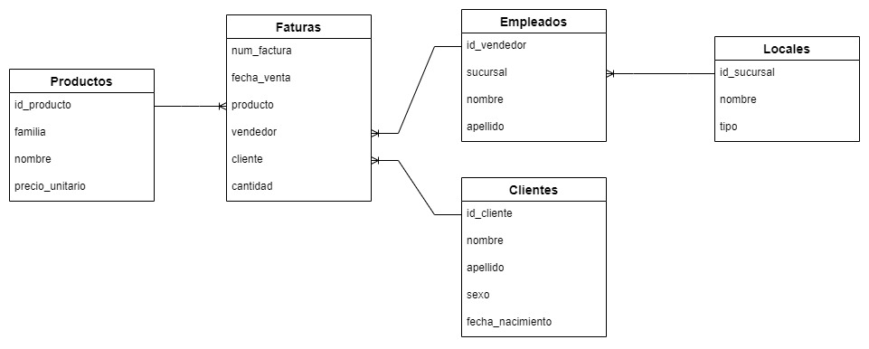

# Trabajo Final SQL - Análisis de Ventas y KPIs Comerciales

Proyecto final de análisis de datos con SQL en Databricks para el área de Demand Planning. Desarrollo de reportes comerciales con diversos KPIs e indicadores segmentados por múltiples dimensiones.

## 🎯 Objetivo
Generar información de valor para el área de Demand Planning mediante reportes comerciales que incluyen:
- KPIs de ventas y performance comercial
- Análisis de transacciones por período
- Segmentación por clientes, productos, empleados y sucursales
- Indicadores de movimiento de mercadería

## 📊 Modelo de Datos

**Tablas del sistema:**
- **Clientes**: Listado de clientes registrados en el sistema
- **Empleados**: identificador, nombre, apellido, sucursal
- **Locales**: identificador, nombre, tipo de local (sucursales)
- **Productos**: identificador, descripción, precio, familia de producto
- **Facturas**: transacciones de venta con fecha, empleado, cliente y cantidad

## 📁 Contenido
- `Trabajo Final.sql` - Consultas y análisis completo del proyecto
- `DER-Ventas.jpg` - Diagrama del modelo de datos

## 🛠️ Tecnologías
- SQL
- Databricks
